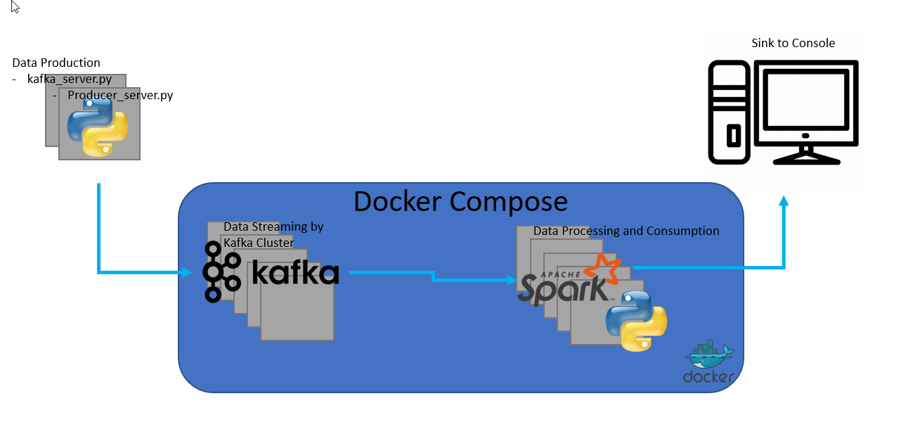
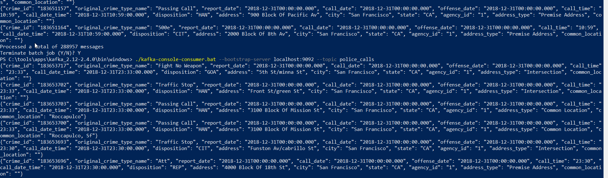
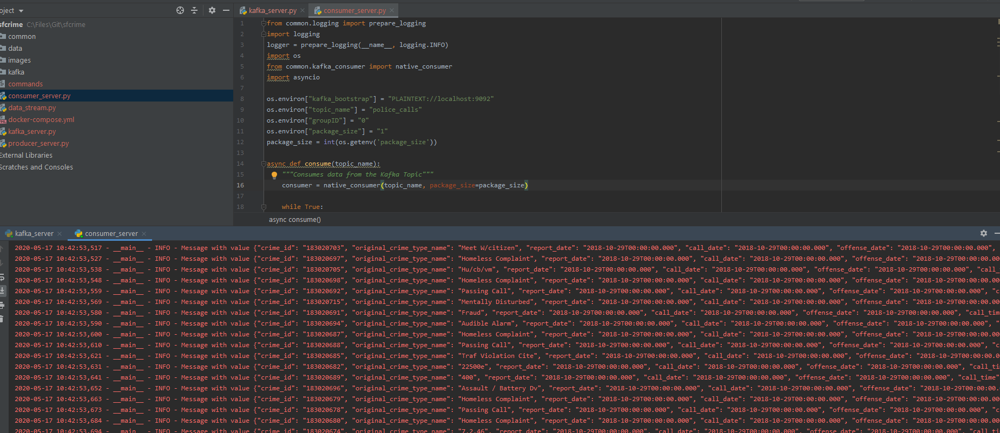
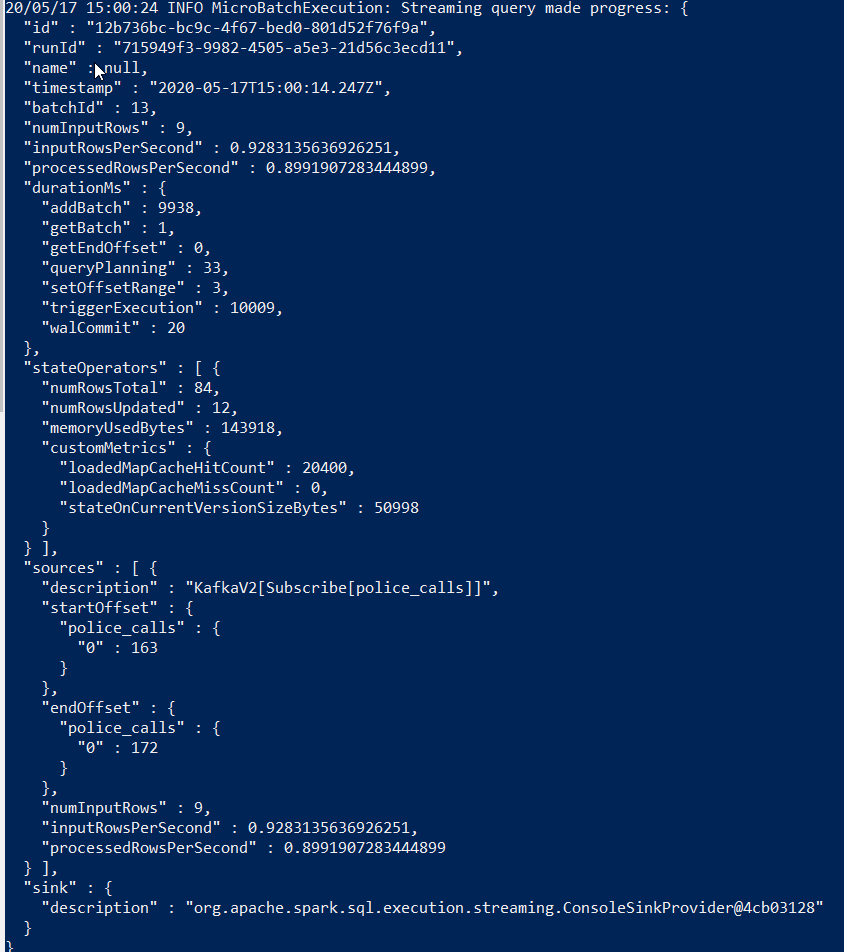
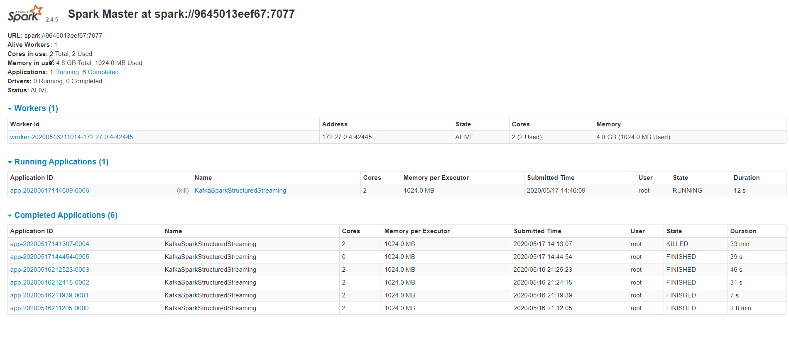
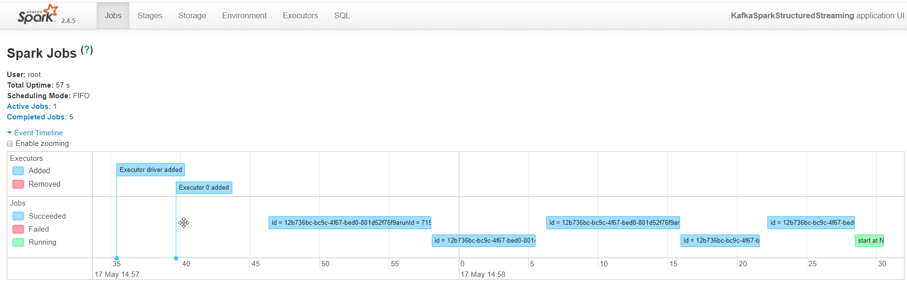
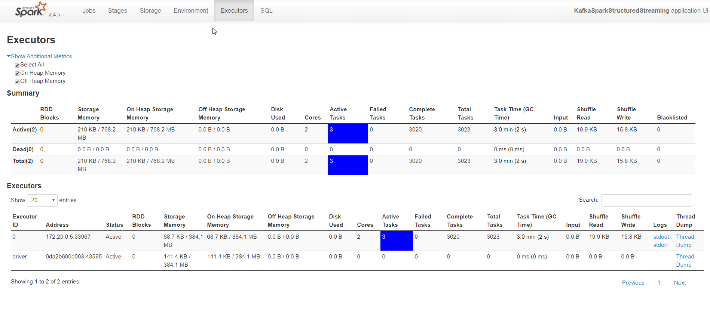
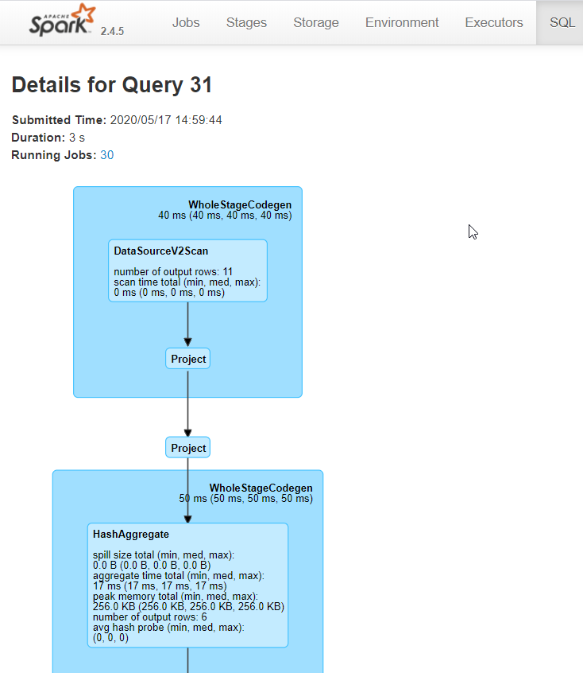
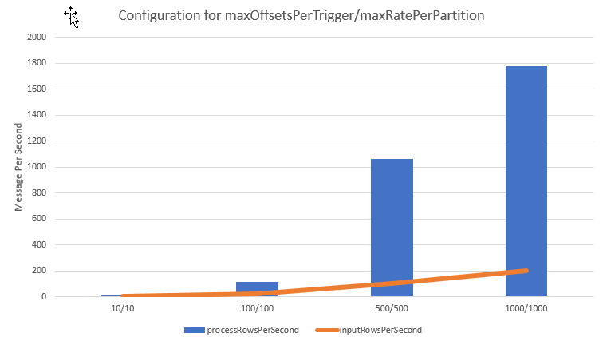

# Project. SF Crime with Spark Streaming

## Solution Architecture

## Main Modules

### Common (directory with reusable libraries)
This common module contains reusable modules created during the Data Ingest phase of the Program:
- kafka_consumer. Generic function using Confluent Kafka Python library to consumer Kafka topics
- kafka_producer. Generic function using Confluent Kafka Python library to produce Kafka messages on a given topic     
- logging. Generic function for logging

### producer_server.py
Main component responsible  to produce data based on the json file.

### kafka_server.py
Wrapper in top of producer_server.py to produce data based on police-department-calls-for-service.json. 

### consumer_server.py
Simple consumer in python which prints to the console the messages consumed in Kafka.

### data_stream.py
Python code to be submitted as Spark job to consume messages from Kafka and join with data static data.

## Screenshots

Here the screenshot of the kafka-consumer-console after executing the kafka_server.py

Here the screenshot of the Python Kafka consumer while running kafka_server.py and consumer_server.py

Here the screenshot of one of the progress report while running the Spark job

Here some screenshot from Spark UI while the job is running

 

## Questions

- How did changing values on the SparkSession property parameters affect the throughput and latency of the data?

Latency of the data can easily modified using the "processingTime" parameter during the start of the query, that will allow us to define how frequently we want to read from Kafka.

What I believe is more interesting are the two parameters "maxOffsetsPerTrigger" and "maxRatePerPartition", which help to improve the throughput of not just how many messages we ingest, but also the processing of the message. 

By example the following chart shows the increase in throughput for both input and process while adjusting the two mentioned parameters.

- What were the 2-3 most efficient SparkSession property key/value pairs? Through testing multiple variations on values, how can you tell these were the most optimal?

As it was mentioned in the previous answer, I found that high processingTime, by example 5 seconds, with high maxOffsetsPerTrigger and maxRatePerPartition, by example 1000 for both parameters,  give us the best throughput with less overhead (visible in CPU time) by retrieving  messages from Kafka every 5 seconds instead of continuously. 